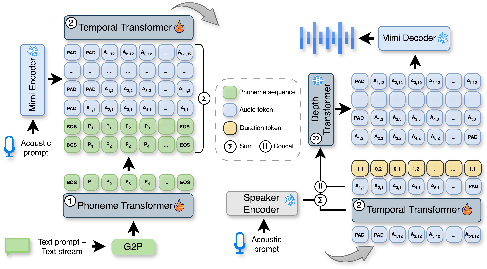

  <h1>VoXtream: Full-Stream Text-to-Speech with Extremely Low Latency</h1>

  <!-- badges -->
  

    
    
    
  

  <!-- authors -->
  

    

        

            <a href="https://herimor.github.io">
                Nikita Torgashov
            </a>
            <a href="https://people.kth.se/~ghe">
                Gustav Eje Henter
            </a>
            <a href="https://www.kth.se/profile/skantze">
                Gabriel Skantze
            </a>
        

        

            Department of Speech, Music and Hearing, KTH Royal Institute of Technology, Stockholm, Sweden
        

    

  

  <iframe
    src="https://www.youtube-nocookie.com/embed/KXvq72rdDtc?si=_rwHlQrm7S_F9dlF"
    width="560"
    height="315"
    title="VoXtream demo"
    frameborder="0"
    allow="accelerometer; autoplay; clipboard-write; encrypted-media; gyroscope; picture-in-picture; web-share"
    referrerpolicy="strict-origin-when-cross-origin"
    allowfullscreen>
  </iframe>

  <!-- abstract -->
  <h2>Overview</h2>
  

    We present VoXtream, a fully autoregressive, zero-shot streaming text-to-speech system for real-time use that begins speaking from the first word.
    <ul style="font-size: 16px; text-align:left;">
        <li><b>Streaming</b>: Support a full-stream scenario, where the full sentence is not known in advance. The model takes the text stream coming word-by-word as input and outputs an audio stream in 80ms chunks.</li>
        <li><b>Speed</b>: Works <b>5x</b> times faster than real-time and achieves <b>102 ms</b> first packet latency on GPU.</li>
        <li><b>Quality and efficiency</b>: With only 9k hours of training data, it matches or surpasses the quality and intelligibility of larger models or models trained on large datasets.</li>
    </ul>
  

  

  Try <a href="https://huggingface.co/spaces/herimor/voxtream" target="_blank">VoXtream ⚡</a> in your browser on HuggingFace 🤗 spaces.
  

  <!-- architecture -->
  
  
  <!-- non stream audio -->
  <h2>Short-form Zero-shot TTS</h2>

  

  <table style="
           border-collapse:collapse;
           width:auto;                /* don't shrink to container */
           margin:0 auto;             /* keep centered when not scrolling */
           table-layout:auto;
           white-space:nowrap;">
    <thead>
        <tr style="border-bottom:3px solid currentColor;">
            <th style="vertical-align : middle;text-align: center">Speech Prompt</th>
            <th style="vertical-align : middle;text-align: center">Text</th>
            <th style="vertical-align : middle;text-align: center">XTTS-v2</th>
            <th style="vertical-align : middle;text-align: center">VoiceCraft</th>
            <th style="vertical-align : middle;text-align: center">VoXtream</th>
        </tr>
    </thead>
    <tbody>
    <tr>
        <td style="vertical-align : middle;text-align:center;border:0;"><audio controls="controls" style="width: 200px;"><source src="assets/audio/common_voice_en_19730681.wav" autoplay="">Your browser does not support the audio element.</audio> </td>
        <td style="vertical-align: middle; height: 100px; border:0; overflow-wrap: break-word; white-space: normal;">In general, however, some method is then needed to evaluate each approximation.</td>
        <td style="vertical-align : middle;text-align:center;border:0;"><audio controls="controls" style="width: 200px;"><source src="assets/audio/common_voice_en_19730683_xtts.wav" autoplay="">Your browser does not support the audio element.</audio>  </td>
        <td style="vertical-align : middle;text-align:center;border:0;"><audio controls="controls" style="width: 200px;"><source src="assets/audio/common_voice_en_19730683_voicecraft.wav" autoplay="">Your browser does not support the audio element.</audio>  </td>
        <td style="vertical-align : middle;text-align:center;border:0;"><audio controls="controls" style="width: 200px;"><source src="assets/audio/common_voice_en_19730683_voxtream.wav" autoplay="">Your browser does not support the audio element.</audio>  </td>
    </tr>
    <tr>
        <td style="vertical-align : middle;text-align:center;border:0;"><audio controls="controls" style="width: 200px;"><source src="assets/audio/common_voice_en_37133940.wav" autoplay="">Your browser does not support the audio element.</audio> </td>
        <td style="vertical-align: middle; height: 100px; border:0; overflow-wrap: break-word; white-space: normal;">His half-brother, Richard Ainley, was also an actor.</td>
        <td style="vertical-align : middle;text-align:center;border:0;"><audio controls="controls" style="width: 200px;"><source src="assets/audio/common_voice_en_37134010_xtts.wav" autoplay="">Your browser does not support the audio element.</audio>  </td>
        <td style="vertical-align : middle;text-align:center;border:0;"><audio controls="controls" style="width: 200px;"><source src="assets/audio/common_voice_en_37134010_voicecraft.wav" autoplay="">Your browser does not support the audio element.</audio>  </td>
        <td style="vertical-align : middle;text-align:center;border:0;"><audio controls="controls" style="width: 200px;"><source src="assets/audio/common_voice_en_37134010_voxtream.wav" autoplay="">Your browser does not support the audio element.</audio>  </td>
    </tr>
    <tr>
        <td style="vertical-align : middle;text-align:center;border:0;"><audio controls="controls" style="width: 200px;"><source src="assets/audio/common_voice_en_21534516.wav" autoplay="">Your browser does not support the audio element.</audio> </td>
        <td style="vertical-align: middle; height: 100px; border:0; overflow-wrap: break-word; white-space: normal;">A number of choirs, bands and sporting clubs are also present.</td>
        <td style="vertical-align : middle;text-align:center;border:0;"><audio controls="controls" style="width: 200px;"><source src="assets/audio/common_voice_en_21534520_xtts.wav" autoplay="">Your browser does not support the audio element.</audio>  </td>
        <td style="vertical-align : middle;text-align:center;border:0;"><audio controls="controls" style="width: 200px;"><source src="assets/audio/common_voice_en_21534520_voicecraft.wav" autoplay="">Your browser does not support the audio element.</audio>  </td>
        <td style="vertical-align : middle;text-align:center;border:0;"><audio controls="controls" style="width: 200px;"><source src="assets/audio/common_voice_en_21534520_voxtream.wav" autoplay="">Your browser does not support the audio element.</audio>  </td>
    </tr>
    <tr>
        <td style="vertical-align : middle;text-align:center;border:0;"><audio controls="controls" style="width: 200px;"><source src="assets/audio/common_voice_en_19602798.wav" autoplay="">Your browser does not support the audio element.</audio> </td>
        <td style="vertical-align: middle; height: 100px; border:0; overflow-wrap: break-word; white-space: normal;">Staff do not always do enough to prevent violence.</td>
        <td style="vertical-align : middle;text-align:center;border:0;"><audio controls="controls" style="width: 200px;"><source src="assets/audio/common_voice_en_19602797_xtts.wav" autoplay="">Your browser does not support the audio element.</audio>  </td>
        <td style="vertical-align : middle;text-align:center;border:0;"><audio controls="controls" style="width: 200px;"><source src="assets/audio/common_voice_en_19602797_voicecraft.wav" autoplay="">Your browser does not support the audio element.</audio>  </td>
        <td style="vertical-align : middle;text-align:center;border:0;"><audio controls="controls" style="width: 200px;"><source src="assets/audio/common_voice_en_19602797_voxtream.wav" autoplay="">Your browser does not support the audio element.</audio>  </td>
    </tr>
    </tbody>
  </table>
  

  
  <!-- stream audio -->
  <h2>Full-stream Zero-shot TTS</h2>

  

  In the full-stream scenario, the input text comes incrementally, word by word, emulating the output of LLM.
  

  

  <table style="
           border-collapse:collapse;
           width:auto;                /* don't shrink to container */
           margin:0 auto;             /* keep centered when not scrolling */
           table-layout:auto;
           white-space:nowrap;">
    <thead>
        <tr style="border-bottom:3px solid currentColor;">
            <th style="vertical-align : middle;text-align: center">Speech Prompt</th>
            <th style="vertical-align : middle;text-align: center">Text</th>
            <th style="vertical-align : middle;text-align: center">CosyVoice2</th>
            <th style="vertical-align : middle;text-align: center">VoXtream</th>
        </tr>
    </thead>
    <tbody>
    <tr>
        <td style="vertical-align : middle;text-align:center;border:0;"><audio controls="controls" style="width: 200px;"><source src="assets/audio/7176-88083-0021.wav" autoplay="">Your browser does not support the audio element.</audio>  </td>
        <td style="vertical-align: middle; height: 100px;border:0; overflow-wrap: break-word; white-space: normal;">were too much for his pursuer and he was able to flap his way onward in a cloud of foam while doom hung low above his head yet hesitated to strike</td>
        <td style="vertical-align : middle;text-align:center;border:0;"><audio controls="controls" style="width: 200px;"><source src="assets/audio/7176-88083-0021_cosyvoice2.wav" autoplay="">Your browser does not support the audio element.</audio>  </td>
        <td style="vertical-align : middle;text-align:center;border:0;"><audio controls="controls" style="width: 200px;"><source src="assets/audio/7176-88083-0021_voxtream.wav" autoplay="">Your browser does not support the audio element.</audio>  </td>
    </tr>
    <tr>
        <td style="vertical-align : middle;text-align:center;border:0;"><audio controls="controls" style="width: 200px;"><source src="assets/audio/1221-135767-0007.wav" autoplay="">Your browser does not support the audio element.</audio>  </td>
        <td style="vertical-align: middle; height: 100px;border:0; overflow-wrap: break-word; white-space: normal;">the other and only in consequence of that identity had hester contrived so perfectly to represent the scarlet letter in her appearance</td>
        <td style="vertical-align : middle;text-align:center;border:0;"><audio controls="controls" style="width: 200px;"><source src="assets/audio/1221-135767-0007_cosyvoice2.wav" autoplay="">Your browser does not support the audio element.</audio>  </td>
        <td style="vertical-align : middle;text-align:center;border:0;"><audio controls="controls" style="width: 200px;"><source src="assets/audio/1221-135767-0007_voxtream.wav" autoplay="">Your browser does not support the audio element.</audio>  </td>
    </tr>
    <tr>
        <td style="vertical-align : middle;text-align:center;border:0;"><audio controls="controls" style="width: 200px;"><source src="assets/audio/2300-131720-0019.wav" autoplay="">Your browser does not support the audio element.</audio>  </td>
        <td style="vertical-align: middle; height: 100px;border:0; overflow-wrap: break-word; white-space: normal;">under the strenuous competition that was already springing up was enormously improved by the introduction of the three wire system and it gave an immediate impetus to incandescent lighting</td>
        <td style="vertical-align : middle;text-align:center;border:0;"><audio controls="controls" style="width: 200px;"><source src="assets/audio/2300-131720-0019_cosyvoice2.wav" autoplay="">Your browser does not support the audio element.</audio>  </td>
        <td style="vertical-align : middle;text-align:center;border:0;"><audio controls="controls" style="width: 200px;"><source src="assets/audio/2300-131720-0019_voxtream.wav" autoplay="">Your browser does not support the audio element.</audio>  </td>
    </tr>
    <tr>
        <td style="vertical-align : middle;text-align:center;border:0;"><audio controls="controls" style="width: 200px;"><source src="assets/audio/1284-1180-0030.wav" autoplay="">Your browser does not support the audio element.</audio>  </td>
        <td style="vertical-align: middle; height: 100px;border:0; overflow-wrap: break-word; white-space: normal;">for my servant girl for when she was brought to life she would not be proud nor haughty as the glass cat is for such a dreadful mixture of colors would discourage her from trying to be as dignified as the blue munchkins are</td>
        <td style="vertical-align : middle;text-align:center;border:0;"><audio controls="controls" style="width: 200px;"><source src="assets/audio/1284-1180-0030_cosyvoice2.wav" autoplay="">Your browser does not support the audio element.</audio>  </td>
        <td style="vertical-align : middle;text-align:center;border:0;"><audio controls="controls" style="width: 200px;"><source src="assets/audio/1284-1180-0030_voxtream.wav" autoplay="">Your browser does not support the audio element.</audio>  </td>
    </tr>
    </tbody>
  </table>

  <h2 style="margin:2rem auto 1rem;">Long-form TTS</h2>

  

  VoXtream is able to generate very long sequences in a full-stream scenario with high intelligibility. The model is punctuation agnostic and works with a very limited look-ahead of at most 10 phonemes, which is why the prosody is not perfect. Although VoXtream can preserve the speaker's voice and produce understandable speech for up to a minute. An example of such generation:
  

  <audio controls="controls" style="width: 300px;"><source src="assets/audio/abstract.wav" autoplay="">Your browser does not support the audio element.</audio>
  

  <b>Text</b>:
    We present VoXtream, a zero-shot streaming text-to-speech system for real-time use that begins speaking from the first word. VoXtream directly maps incoming phonemes to audio tokens using a monotonic alignment and a dynamic look-ahead. Built around an incremental phoneme transformer, a temporal transformer predicting semantic and duration tokens, and a depth transformer producing acoustic tokens, VoXtream achieves the lowest initial delay among public streaming text-to-speech: 102 milliseconds. Despite being trained on a 9000-hour corpus, it matches or surpasses larger baselines on several metrics. <b>The audio you are listening to is generated by our model in full-streaming mode.</b>
  

  <h2>Citation</h2>
  

  <pre class="bibtex">@article{torgashov2025voxtream,
  author    = {Torgashov, Nikita and Henter, Gustav Eje and Skantze, Gabriel},
  title     = {Vo{X}tream: Full-Stream Text-to-Speech with Extremely Low Latency},
  journal   = {arXiv:2509.15969},
  year      = {2025}
}</pre>

